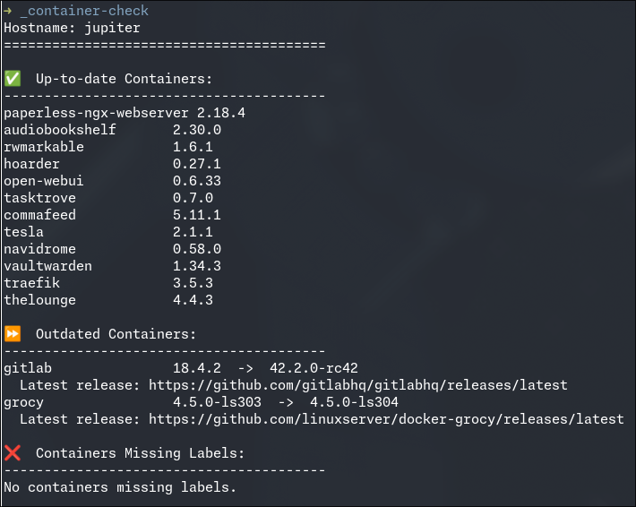
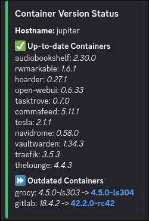

# NixOS Configuration
Est. Feb 2024

My always evolving Nix flake ❄️ for declarative system and user environment management across multiple machines.

## Flake Inputs
| Name | Details |
|:-----------| :------|
| [nixpkgs](https://github.com/NixOS/nixpkgs/tree/nixos-25.05) | Primary Nix package collection (25.05 release) |
| [unstable](https://github.com/NixOS/nixpkgs/tree/nixos-unstable) | Unstable Nixpkgs for newer packages |
| nixos-thurs | Private repository for sops secrets and private modules |
| [home-manager](https://github.com/nix-community/home-manager/tree/release-25.05) | Declarative management of user environments (imported as NixOS and Darwin modules) |
| [lanzaboote](https://github.com/nix-community/lanzaboote) | Unified EFI bootloader for NixOS (used in specific hosts) |
| [nix-darwin](https://github.com/LnL7/nix-darwin) | System configuration for macOS using Nix |
| [nix-index-database](https://github.com/nix-community/nix-index-database) | Database for `nix-index` for faster command discovery |
| [nixos-generators](https://github.com/nix-community/nixos-generators) | Tool for generating NixOS system images for various platforms (AMI, ISO, VM, SD) |
| [nixvim](https://github.com/nix-community/nixvim/tree/main) | Declarative Neovim configuration framework |
| [ssh-keys](https://github.com/thursdaddy.keys) | Fetches public SSH keys from GitHub |
| [sops-nix](https://github.com/Mic92/sops-nix) | Nix integration for SOPS (Secrets OPerationS) for managing encrypted secrets |

## Modules

This repository is organized into several module categories.

-   **[NixOS Modules](https://github.com/thursdaddy/nixos-config/tree/main/modules/nixos):** System-level configurations specific to NixOS.
-   **[Home Manager Modules](https://github.com/thursdaddy/nixos-config/tree/main/modules/home):** User-level configurations managed by [Home Manager](https://github.com/nix-community/home-manager).
-   **[Darwin Modules](https://github.com/thursdaddy/nixos-config/tree/main/modules/darwin):** System-level configurations specific to macOS (via [nix-darwin](https://github.com/nix-darwin/nix-darwin)).
-   **[NixVim Modules](https://github.com/thursdaddy/nixos-config/tree/main/modules/nixvim):** Declarative Neovim configuration.
-   **[Shared Modules](https://github.com/thursdaddy/nixos-config/tree/main/modules/shared):** Configurations that are common across both NixOS and Darwin systems.

Each module set has an `import.nix` file within its root directory to recursively find and import all `default.nix` files beneath it. The import files are declared in the hosts `configuration.nix` [imports](https://github.com/thursdaddy/nixos-config/blob/main/hosts/c137/configuration.nix#L15) section.

All modules are disabled by default and can be enabled using options, like `services.atticd.enable = true;`.

This repository follows an opinionated, modular layout. While it may look overwhelming at first, the structure makes it easy to copy and paste existing configurations to develop new modules or support new hosts.

## Structure

```
├── assets/          # Wallpapers and other miscellaneous assets
├── hosts/
│   ├── c137/        # Main desktop configuration (AMD 5950x, 64GB DDR4, AMD 6600XT)
│   ├── cloudbox/    # AWS instance configuration
│   ├── homebox/     # home server configuration (Lenovo ThinkCentre M700, i5-6500T, 16GB DDR4)
│   ├── mbp/         # Darwin (M1 MacBookPro) configuration
│   ├── netpi/       # RaspPi4 configurations (e.g., for pi-hole + Tailscale)
│   ├── printpi/     # RaspPi4 configuration for Octoprint
│   ├── proxbox1/    # Proxmox VE host configuration
│   ├── jupiter/     # VM configuration for self-hosted apps
│   ├── kepler/      # VM configuration for monitoring tools
│   └── wormhole/    # VM configuration for general use
├── flake.nix
├── flake.lock
├── nix.sh           # Wrapper script for misc operations
├── justfile         # Task runner for nix.sh (build, rebuild, lint, update)
├── lib/             # Custom Nix library functions (extending `nixpkgs.lib`)
├── modules/
│   ├── darwin/      # macOS-specific configurations (applications, system settings, CLI tools)
│   ├── home/        # Home Manager configurations (user-level apps, desktop environments, CLI tools)
│   ├── nixos/       # NixOS-specific configurations (applications, desktop, services, system settings)
│   ├── nixvim/      # NixVim plugin and option configurations
│   └── shared/      # Configurations shared between NixOS and macOS systems (aliases, fonts, CLI tools)
├── overlays/        # Nixpkgs overlays for custom package versions or modifications
├── packages/        # Custom Nix packages defined within this repository
└── systems/         # Definitions for `nixos-generators` targets (AMI, ISO, SD, VM)
```

## Helper Script

This repository uses a [`justfile`](./justfile) and a wrapper script ([`nix.sh`](./nix.sh)) to simplify common Nix operations. Below is a summary of the available commands.

| Command | Description |
| :--- | :--- |
| `just rebuild` | Rebuilds the configuration for the current host (local NixOS or Darwin). |
| `just <hostname>` | Rebuilds the configuration for a specific remote NixOS host (e.g., `just c137`). |
| `just build <target>` | Builds artifacts (e.g., configurations found under flake.nix `packages`). |
| `just update <input>` | Updates a specific flake input (e.g., `just update nixpkgs`). |
| `just update all` | Updates all flake inputs in `flake.lock`. |
| `just local <input>` | Switches a flake input to a local path for development. |
| `just attic <hostname>` | Builds and pushes a host's derivation to the [Attic](https://github.com/zhaofengli/attic) binary cache. |
| `just attic all` | Builds and pushes derivations for all hosts to the Attic cache. |
| `just statix` | Lints all Nix files in the repository with `statix check`. |

## Highlights

#### 🏠 Declarative Home Assistant

The [Home Assistant module](./modules/nixos/apps/home-assistant) provides a fully declarative configuration for a complete smart home setup. Key features include:

- **Declarative Integrations:** All integrations, including Zigbee2MQTT, Govee, and MQTT, are defined in Nix, ensuring a reproducible setup.
- **Entities as Code:** Home Assistant entities and sensor configurations are managed directly in YAML files within the repository.
- **Automations as Code:** Technically not in nix but I am using AppDaemon to create and manage automations via Python: [appdaemon-scripts](https://github.com/thursdaddy/appdaemon-scripts)

#### 🐳 Docker Containers with Traefik and Version Update Checks

The [container](./modules/nixos/containers) modules demonstrate how to manage containerized services declaratively.

- **Traefik Integration:** Traefik configuration via Docker labels, simplifying reverse proxy and SSL management. Manage local DNS via [Blocky](https://github.com/thursdaddy/nixos-config/blob/main/modules/nixos/services/blocky/blocky.yml)
- **Log ingestion via Alloy & Loki**: Create Alloy [configuration](https://github.com/thursdaddy/nixos-config/blob/main/modules/nixos/containers/audiobookshelf/config.alloy) files to ingest docker logs via journalctl and send to [Grafana Loki](https://grafana.com/oss/loki/).
- **Version Checker:** A custom [update script](./modules/nixos/services/docker/scripts/container-version-check.py) utilizes the common `org.opencontainers.*` label format to check for new container image versions and link to latest releases.

Can be run ad-hoc or even configured via a GitLab CI pipeline to send notifications via Discord.

<table align="center">
  <tr>
    <td align="center">Terminal Output</td>
    <td align="center">Discord Notification</td>
  </tr>
  <tr>
    <td></td>
    <td></td>
  </tr>
</table>

